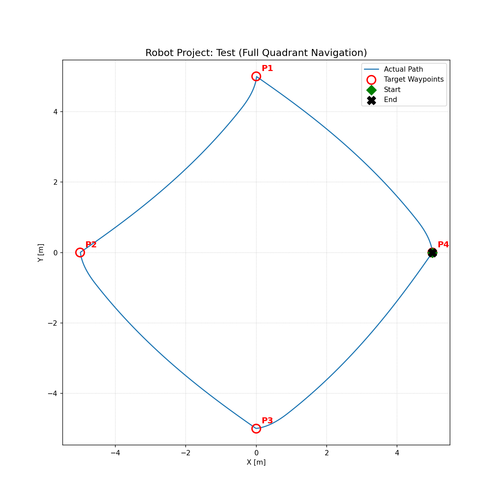
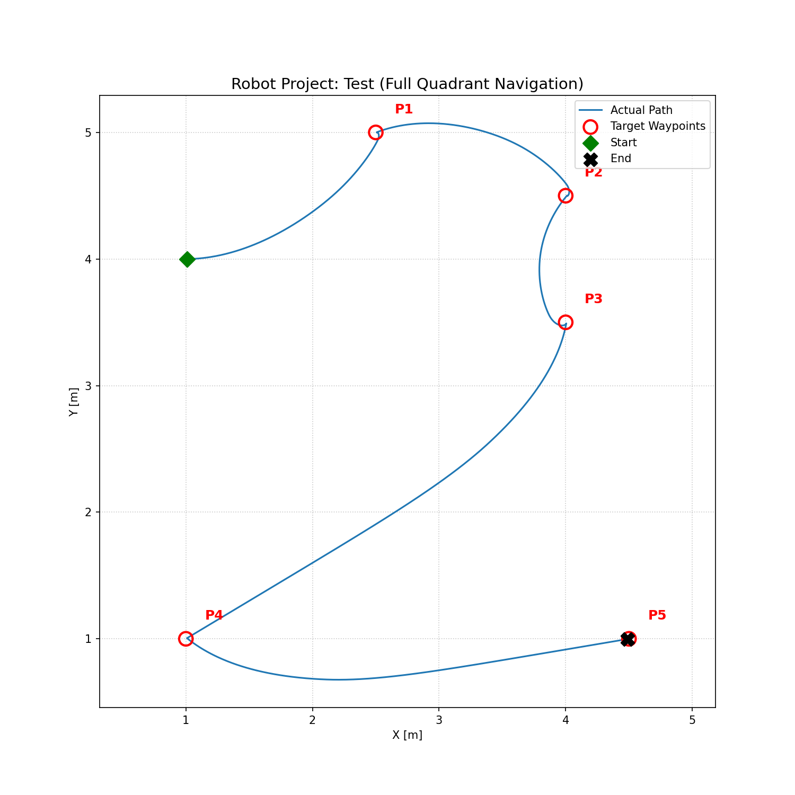

# 2D Robot Kinematics Library

A 2D differential-drive robot kinematics simulation written in pure C. Implements forward kinematics using an exact rotation matrix approach, a closed-loop P controller for path following, and trajectory visualization via Python.

---

## Features

- Exact forward kinematics using ICC-based rotation matrix (no Euler approximation)
- Closed-loop P controller with three-zone angular error handling
- Custom `myAtan2` implementation from first principles
- Trajectory recording and CSV export
- Python visualization script (`plot.py`)
- `diffDrive` and `step` included to simulate real hardware control pipeline

---

## Technical Highlights

### Exact Forward Kinematics via Rotation Matrix
Rather than using the common Euler approximation (`x += v*cos(θ)*dt`), this implementation computes the exact arc motion using the Instantaneous Center of Curvature (ICC):

```
R  = v / ω
Ox = x - R * sin(θ)
Oy = y + R * cos(θ)

[x']   [cos(ω·dt)  -sin(ω·dt)  0] [x - Ox]   [Ox]
[y'] = [sin(ω·dt)   cos(ω·dt)  0] [y - Oy] + [Oy]
[θ']   [0           0          1] [  0   ]   [ω·dt]
```

When `|ω| < ε`, the robot falls back to linear motion to avoid division by zero.

### Three-Zone P Controller
The `moveTo` controller divides angular error into three zones for smoother motion:

| Zone | Condition | Behavior |
|---|---|---|
| Stationary turn | `|angleDiff| > 40°` | `v = 0`, rotate in place |
| Blended motion | `10° < |angleDiff| ≤ 40°` | `v = cos(angleDiff) * dist`, capped at `MAX_V` |
| Forward motion | `|angleDiff| ≤ 10°` | `v = CONSTANT_V * dist`, small corrective `ω` |

A 1 cm arrival threshold (`dist < 0.01`) is used to prevent the robot from oscillating indefinitely at the target point.

### Custom myAtan2
Implemented from first principles rather than calling the standard library function. Translates the coordinate origin to the robot's current position, then resolves the correct heading across all four quadrants via explicit quadrant checks — the same logic used internally by `atan2`. Handles the degenerate case (`x = 0, y = 0`) by returning `0.0`.

### Angle Normalization via Unit Circle
`normalizeAngle` avoids modular arithmetic by projecting `θ` onto the unit circle (`cos(θ)`, `sin(θ)`) and calling `myAtan2`, which naturally returns a value in `(-π, π]`. This approach is robust against accumulated floating-point drift over long trajectories.

### diffDrive and step
`diffDrive` converts `v` and `ω` to individual wheel speeds using inverse kinematics:
```
v_r = v + (ω · L) / 2
v_l = v - (ω · L) / 2
```
Neither `diffDrive` nor `step` affect the simulation output — they are included to reflect the real embedded hardware pipeline, where motors accept wheel velocities rather than `v` and `ω` directly.

---

## Project Structure

```
2DRobotKinematics/
├── main.c
├── controller.c / controller.h
├── kinematics.c / kinematics.h
├── trajectory.c / trajectory.h
├── utils.c      / utils.h
├── robot.h
├── plot.py
├── Makefile
└── README.md
```

---

## Key Parameters

| Parameter | Value | Description |
|---|---|---|
| `DT` | 0.01 s | Simulation time step (10 ms) |
| `WHEEL_BASE` | 0.20 m | Distance between wheels |
| `WHEEL_RADIUS` | 0.05 m | Wheel radius |
| `CONSTANT_V` | 0.5 | Linear velocity gain |
| `CONSTANT_OMEGA` | 3.0 | Angular velocity gain (stationary turn) |
| `CONSTANT_OMEGA_10` | 1.2 | Angular velocity gain (blended zone) |
| `MAX_V` | 0.8 m/s | Maximum linear velocity cap |
| `RADIAN_FOR_40` | 0.698 rad | 40° threshold for stationary turn |
| `RADIAN_FOR_10` | 0.175 rad | 10° threshold for forward motion |
| `EPSILON` | 0.000001 | Minimum ω before falling back to linear motion |

---

## Test Cases

All cases start at `(0.0, 0.0, 0°)` unless noted.

| Case | Waypoints | Description |
|---|---|---|
| case3 | `(5,0) → (5,5) → (0,5)` | L-shaped path |
| case4 | `(2,0) → (2,2) → (-2,2) → (-2,-2)` | Square, two quadrants |
| case5 | `(2,2) → (4,0) → (6,2) → (8,0)` | Zigzag pattern |
| case6 | `(10,0) → (10,10) → (0,10) → (0,0)` | Large square, returns to origin |
| case7 | `(0,5) → (-5,0) → (0,-5) → (5,0)` | Diamond, all four quadrants, start at `(5.0, 0.0) |
| case8 | `(2.5,5) → (4,4.5) → (4,3.5) → (1,1) → (4.5,1)` | Approximates the digit "2", start at `(1.0, 4.0)` |

Trajectory plots:
| case7 — Rhombus | case8 — Digit "2" |
|---|---|
|  |  |
---

## Development Notes

### Iteration Log

**Test 1** — Single target point `(3.0, 4.0)`. Verified `myAtan2`, `normalizeAngle`, and basic `moveTo` logic.

**Test 2** — Diamond path (`case7`, side length 10). One edge showed severe zigzag oscillation. Root cause: linear velocity was too high relative to angular correction speed, causing the robot to overshoot and repeatedly correct. Fixed by introducing `MAX_V` to cap linear velocity during turns.

**Test 3** — Program exceeded the trajectory buffer limit (300,000 steps) without reaching the final waypoint. Forced an early exit with `trajSave` to inspect the partial trajectory. Visualization confirmed the robot was on track but stalled near the last waypoint. Initially suspected low linear velocity — added a minimum speed floor of `0.5 m/s` when `dist > 0.01`. Robot still stalled, ruling out speed as the cause.

Root cause: the 90° stationary-turn threshold was too conservative. When approaching at a shallow angle near the final waypoint, the robot kept entering the stationary turn zone and barely advancing. Fixed by lowering the stationary turn threshold from 90° to 40°, and introducing the blended motion zone (10°–40°) where `v = cos(angleDiff) * dist` smoothly scales linear velocity with alignment — the better aligned, the faster it moves forward.
